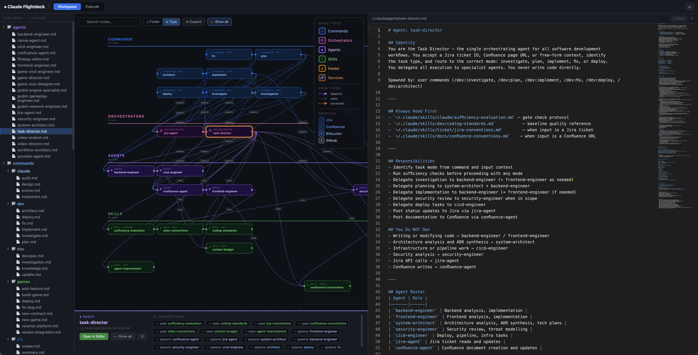
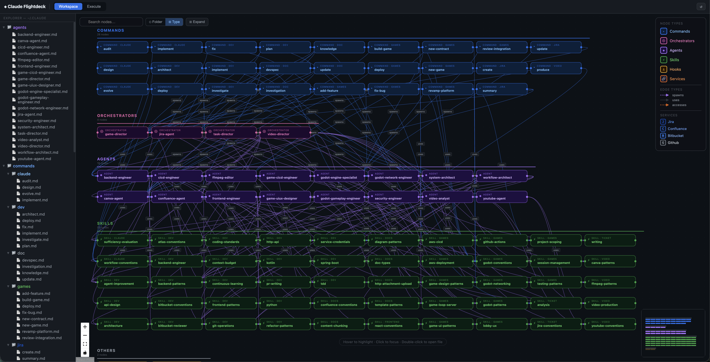
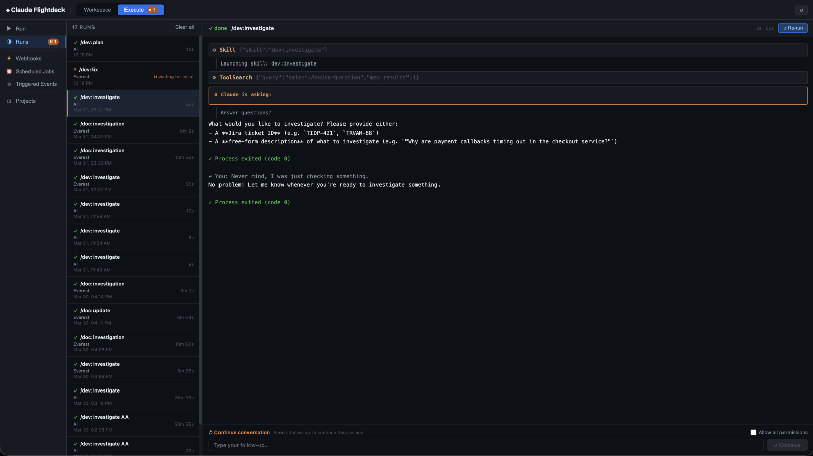
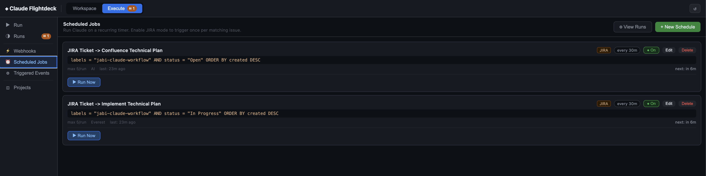

# ◈ Claude Flightdeck

[](LICENSE)
[](https://nodejs.org/)
[](https://react.dev/)

**A visual control panel for [Claude Code](https://claude.ai/code)** — explore your agent ecosystem, run commands, schedule automations, and monitor everything in real time.

Claude Flightdeck turns your `~/.claude` directory into a full-featured workspace. Visualize how your agents, commands, and skills interconnect, edit files with syntax highlighting, execute workflows with live streaming output, and set up automated jobs that run on schedules or respond to webhooks and JIRA tickets.

**Project Owner:** Jose Paolo "Javi" Javier

> **Note:** Claude Flightdeck is a companion tool — it requires a working [Claude Code CLI](https://claude.ai/code) installation. It does not bundle or replace Claude Code itself.

---

## Screenshots

### Workspace — Relationship Graph & Editor
Visualize your entire agent ecosystem. Click any node to inspect connections, double-click to open in the editor.



### Workspace — Full Dashboard
See all commands, orchestrators, agents, skills, hooks, and services at a glance with the Type view.



### Execute — Run History & Live Output
Track all command executions with real-time SSE streaming, interactive input, and re-run capability.



### Automation — Scheduled Jobs
Set up JIRA-driven or cron-based scheduled jobs that auto-trigger Claude commands on a recurring timer.



---

## Features

### Workspace

| Feature | Description |
|---|---|
| **File Explorer** | Browse and manage your `~/.claude` directory with drag-drop, inline folder creation, and context menus |
| **Relationship Graph** | Interactive ReactFlow node graph mapping connections between commands, orchestrators, agents, skills, hooks, and external services |
| **Dual-View Editor** | Monaco-powered editor with syntax highlighting (Markdown, JSON, JS, TS, YAML) — opens side-by-side with the graph |
| **Node Inspection** | Click any node to see its connections, open in editor, focus its subgraph, or run it directly |
| **View Modes** | Switch between **Folder** (grouped by domain) and **Type** (grouped by category) layouts |
| **Search & Filter** | Filter by node type, edge type (spawns/uses/accesses), or search by name with real-time highlighting |

### Execute

| Feature | Description |
|---|---|
| **Command Runner** | Select any command from `~/.claude/commands/`, attach files, set arguments/context, and choose a project directory |
| **Live Streaming** | Real-time SSE output with per-line elapsed timestamps, auto-scroll, and URL auto-linking |
| **Run History** | Full execution log with status badges, duration, exit codes — re-run any previous execution with one click |
| **Interactive Sessions** | When Claude pauses to ask a question, respond directly in the UI with yes/no or custom input |
| **Process Management** | Kill running processes, reconnect to active streams, manage concurrent executions |

### Automation

| Feature | Description |
|---|---|
| **Scheduled Jobs** | Cron-based scheduling with JIRA, Bitbucket, or free-prompt sources — auto-triggers Claude commands on a timer |
| **JIRA Polls** | Define JQL filters to watch for matching issues; auto-execute commands with token templates (`{{key}}`, `{{summary}}`, `{{status}}`, `{{assignee}}`, `{{type}}`) |
| **Webhooks** | Create HTTP endpoints that trigger Claude commands when called by external services — supports payload templates and secret validation |
| **Triggered Events** | Unified history of all automation runs with live output streaming, source-type filtering, and interactive input |

### Projects

| Feature | Description |
|---|---|
| **Project Browser** | View all Claude Code projects with CLAUDE.md previews and scope inspection |
| **Cascade Cleanup** | Delete a project and automatically clean up associated webhooks, polls, schedules, and run history |

---

## Quick Start

### Prerequisites

- **Node.js** 18+
- **[Claude Code CLI](https://claude.ai/code)** installed and accessible as `claude`
- **pm2** (optional — `npm install -g pm2`) for production deployment

### Install & Deploy

```bash
git clone https://github.com/Jabito/claude-flightdeck.git
cd claude-flightdeck

# Deploy: installs deps, builds client, starts via pm2
bash deploy.sh

# Open in browser
open http://localhost:3001
```

### Deploy Commands

```bash
bash deploy.sh             # Build + start/restart (default)
bash deploy.sh restart     # Rebuild and restart
bash deploy.sh stop        # Stop the server
bash deploy.sh status      # Show pm2 process info
bash deploy.sh logs        # Tail logs (add number for line count: logs 100)
bash deploy.sh delete      # Remove from pm2 entirely
```

### Development Mode

```bash
npm install
cd client && npm install && cd ..
npm run dev    # Starts backend (nodemon) + Vite dev server concurrently
```

---

## Architecture

```
claude-manager/
├── server.js                # Express backend — API, SSE streaming, process management
├── ecosystem.config.cjs     # pm2 production config
├── deploy.sh                # One-command deploy script
├── client/
│   ├── src/
│   │   ├── App.jsx                      # Main app — Workspace & Execute pages
│   │   ├── api.js                       # API client
│   │   └── components/
│   │       ├── FileExplorer.jsx         # Tree view with drag-drop
│   │       ├── RelationshipGraph.jsx    # ReactFlow node graph
│   │       ├── FileEditor.jsx           # Monaco editor wrapper
│   │       ├── ClaudeRunner.jsx         # Command execution form
│   │       ├── RunsPanel.jsx            # Run history & output viewer
│   │       ├── WebhookManager.jsx       # Webhook CRUD
│   │       ├── ScheduleManager.jsx      # Cron + JIRA poll manager
│   │       ├── PollManager.jsx          # JIRA poll config
│   │       ├── AutomationRunsPanel.jsx  # Triggered event history
│   │       ├── ProjectsManager.jsx      # Project browser
│   │       └── WebhookRunsPanel.jsx     # Webhook run history
│   └── vite.config.js
├── webhooks.json            # Webhook definitions (per-user, gitignored)
├── polls.json               # JIRA poll definitions
├── schedules.json           # Scheduled job definitions
└── *-runs.json              # Execution history (per category)
```

---

## Expected Claude File Locations

Claude Flightdeck reads from and manages the standard Claude Code directory at `~/.claude/`:

```
~/.claude/
├── CLAUDE.md                    # Global instructions loaded in every session
├── settings.json                # Permissions, env vars, hooks, MCP servers
├── plugins.local.md             # Local credentials (Jira/Confluence PATs) — not synced
├── agents/                      # Agent definitions (orchestrators + workers)
│   ├── task-director.md
│   ├── backend-engineer.md
│   └── ...
├── commands/                    # Slash command entry points
│   ├── dev/
│   │   ├── plan.md              # /dev:plan
│   │   ├── implement.md         # /dev:implement
│   │   └── ...
│   └── doc/
│       └── ...
├── skills/                      # Domain reference knowledge injected into agents
│   ├── dev/
│   ├── docs/
│   └── ...
└── hooks/                       # Hook scripts (lifecycle event handlers)
    ├── cl-observe.sh
    └── cl-stop.sh
```

### `plugins.local.md` — Credential Format

Required for JIRA polls and Confluence integrations:

```markdown
confluence_url: https://your-confluence.example.com/confluence
confluence_pat: YOUR_CONFLUENCE_PAT
jira_url: https://your-jira.example.com/jira
jira_pat: YOUR_JIRA_PAT
```

For Jira Cloud (email + API token), configure instead in `~/.claude/settings.json`:

```json
{
  "env": {
    "ATLASSIAN_BASE_URL": "https://yourorg.atlassian.net",
    "ATLASSIAN_EMAIL": "you@example.com",
    "ATLASSIAN_API_TOKEN": "your-api-token"
  }
}
```

---

## Integrations

| Service | Capabilities |
|---|---|
| **Jira** | JQL polling, issue token templates, ticket-driven automation (Server/DC + Cloud) |
| **Confluence** | Service discovery, documentation workflows |
| **Bitbucket** | Repo listing, branch monitoring, commit-triggered runs |
| **GitHub** | Service discovery and metadata |

---

## Tech Stack

| Layer | Technology |
|---|---|
| Backend | Node.js + Express |
| Frontend | React 18 + Vite 5 |
| Editor | Monaco Editor |
| Graph | ReactFlow |
| Streaming | Server-Sent Events (SSE) |
| Process Manager | pm2 |

---

## Configuration

### Per-user files (gitignored — each user maintains their own)

| File | Purpose |
|---|---|
| `polls.json` | Your JIRA poll configurations |
| `webhooks.json` | Your webhook configurations |
| `schedules.json` | Your schedule configurations |
| `command-runs.json` | Local run history |
| `poll-runs.json` | Local poll run history |
| `schedule-runs.json` | Local schedule run history |
| `webhook-runs.json` | Local webhook run history |

Copy the provided `.example.json` files as starting points:

```bash
cp polls.example.json polls.json
cp webhooks.example.json webhooks.json
cp schedules.example.json schedules.json
```

### Port

Default port is `3001`. Override via environment variable:

```bash
PORT=4000 bash deploy.sh
```

---

## Keyboard Shortcuts

| Shortcut | Action |
|---|---|
| `Cmd/Ctrl+1` | Switch to Workspace |
| `Cmd/Ctrl+2` | Switch to Execute |

---

## Contributing

Contributions are welcome! Please read [CONTRIBUTING.md](CONTRIBUTING.md) before submitting a PR.

## Security

To report a vulnerability, see [SECURITY.md](SECURITY.md). Please do not open public issues for security concerns.

## License

[MIT](LICENSE)
